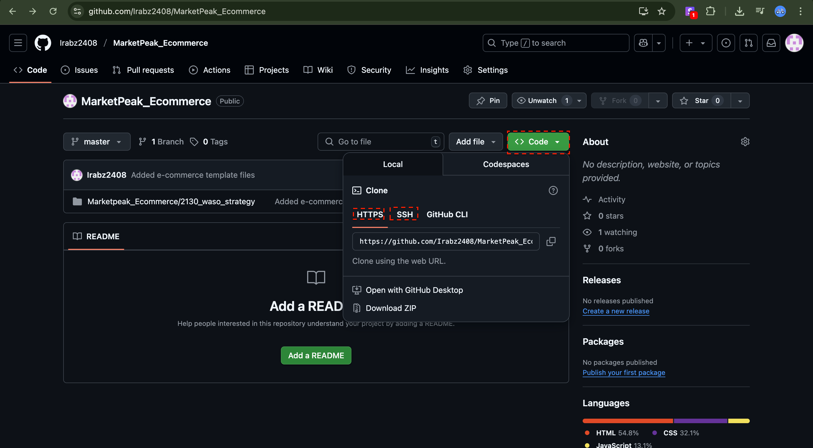
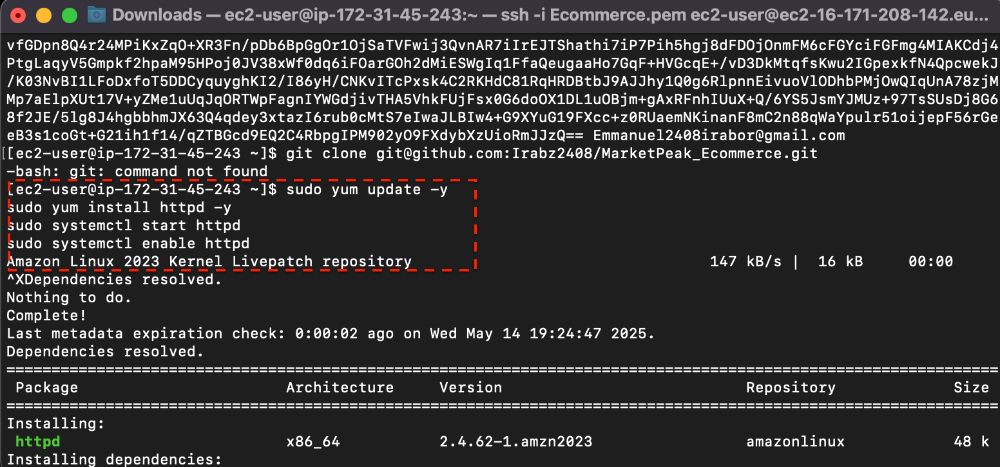
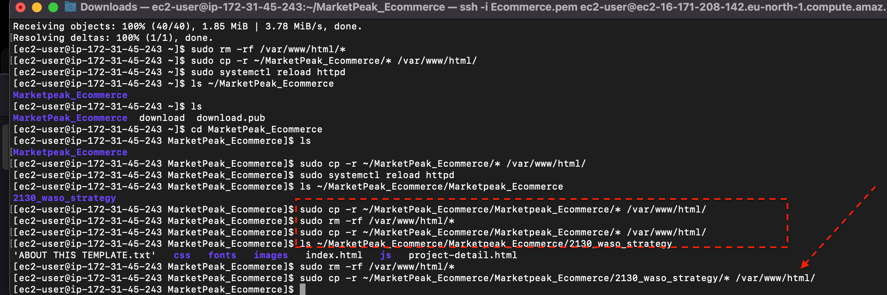

> # E-commerce_website

Scenario 
You have been assigned to develop an e-commerce website for a new online marketplace named "MarketPeak." This platform will feature product listings, a shopping cart, and user authentication. Your objective is to utilize Git for version control, develop the platform in a Linux environment, and deploy it on an AWS EC2 instance. You can find a suitable website template here to kickstart your development 
Tasks 
1. Implement Version Control with Git 1.1. Initialize Git Repository 
Begin by creating a project directory named "MarketPeak_Ecommerce" 
Inside this directory, initialize a Git repository to manage your version control. 

> # Obtain and Prepare the E-Commerce Website Template 
Instead of developing the website from scratch, you'll use a pre-existing e-commerce website template. This approach allows you to focus on the deployment and operational aspects, rather than on web development. The actual web development is done by web/software developers on the project. 
Download a Website Template: Visit Tooplate or any other free template resource, and download a suitable e-commerce website template. Look for templates that are ready to use and require minimal adjustments. 
It is recommended you download the specific template 
Prepare the Website Template: Extract the downloaded template into your project directory, MarketPeak Ecommerce. 
Customize the Template (Optional): If desired and you have basic web development skills, you can make minor customizations to the template to tailor it to "MarketPeak"This might include updating logos, changing color schemes, or modifying text to better fit the marketplace's brand identity. 

* Then i will add the website to tge git repository 

* Then i set my git global configuration with my username and password 
* Then i commit my changes

> # Push the code to your Github repository 
After initializing your Git repository and adding your e-commerce website template, the next I step is to push your code to a remote repository on GitHub. This step is crucial for version contra and collaboration. 
Create a Remote Repository on GitHub: Log into your GitHub account and create a new repository named "MarketPeak_Ecommerce" Leave the repository empty without initializinc it with a README, .gitignore, or license. 
Link Your Local Repository to GitHub: In your terminal, within your project directory, add the remote repository URL to your local repository configuration. 

> # Set Up an AWS EC2 Instance 
Log in to the AWS Management Console. Launch an EC2 instance using an Amazon Linux AMI. Connect to the instance using SSH. 

> # Clone the repository on the Linux Server 
Before deploying your e-commerce platform, you need to clone the GitHub repository to your AWS EC2 instance. This process involves authenticating with GitHub and choosing between tw primary methods of cloning a repository: SSH and HTTPS. To see the ssh or http link to clone yo repository 

1. Navigate to your repository in github console 
2. Select the ' code' as highlighted in the image below. 

* SSH METHOD

on your Ec2 instance generate SSH keypair using-keygen

* Display key and cpoied my public key and i also ran a command "cat /home/ubuntu/.ssh/id_rsa.pub"

> # Install a Web Server on EC2 
Apache HTTP Server  (httpd) is a widely used web server that serves HTML files and content ove the internet. Installing it on Linux EC2 server allows you to host MarketPeak E-commerce site: 
Install Apache web server on the EC2 instance. Note that httpd is the software name for Apache on systems using yum package manager 

"sudo yum update -y
sudo yum install httpd -y
sudo systemctl start httpd
sudo systemctl enable httpd"

> # Configure httpd for Website 
To serve the website from the EC2 instance, configure httpd to point to the directory on the Linux server where the website code files are stored. Usually in /var/www/html. 
Prepare the Web Directory: Clear the default httpd web directory and copy MarketPeak 
* Ecommerce website files to it. 
sudo rm —rf /var/www/html/* sudo cp —r —/MarketPeak_Ecommerce/* /var/www/html/ 

The directory /var/www/html/ is a standard directory structure on Linux systems that host web content, particularly for the Apache HTTP Server. 
When you install Apache on a Linux system, the installation process automatically creates this directory. It's designated as the default document root in Apache's configuration, meaning that Apache is set up to serve web files (such as HTML, CSS, and JavaScript files) located in this directory to visitors of your website. 
Reload httpd: Apply the changes by reloading the httpd service. 

> # Access Website from Browser 
With httpd configured and website files in place, MarketPeak Ecommerce platform is now live on the internet: 
Open a web browser and access the public IP of your EC2 instance to view the deployed website. 

* At first i encountered an issue where the instance wasnt reading the index file on the zip i added so i add to enter the excat directorty to ge it done

* so i had to make sure i got the excat command right and its been pushed from  local to global 

* The final outcome is where the instance ip address ran the webiste 

> # Create a Development Branch: Begin your development 
3. Continuous Integration and Deployment Workflow 
To ensure a smooth workflow for developing, testing, and deploying your e-commerce platform, follow this structured approach. It covers making changes in a development environment, utilizing version control with Git, and deploying updates to your production server on AWS. 
Step 7: Developing New Features and Fixes 
ork by creating a separate 
branch. This isolates new features and bug fixes from the stable version of your website. 
git branch development git checkout development 
Implement Changes: On the development branch, add your new features or bug fixes. This might include updating web pages, adding new products, or fixing known issues. 

